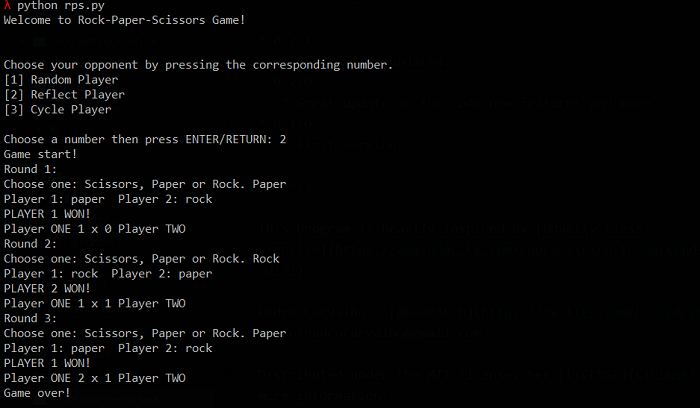

# Rock-Paper-Scissors Game - Udacity Introduction to Programming
> A Rock-Paper-Scissors Game built in Python

For this project, my task was to create a Rock-paper-scissors game. This game is a
Python program. This project has the following requirements:

1. Three rounds;
2. Three Diferents AI's: Reflect Player, Random Player and Cycle Player;
3. The code have to run only in Python;

## Requirements

1. Python 3.7.2

## Development setup

1. Donwload and Install Python 3.7.2 [link](https://www.python.org/downloads/release/python-372/)

## Running the Programming

1. Load the game using `python rps.py` or `python3 rps.py`.

## Usage example

2. Choose from your opponents by pressing `1`, `2` or `3`.

3. write your moves every round: `rock`, `paper` or `scissors`.

4. Have a nice game!

_If you find some bugs or problems you can send a message to me [twitter] or [email]._

## Release History

* 0.2.0
   * README file updated.
* 0.1.0
   * First version.

## Meta

Pedro Carvalho – [@PedrArch](https://twitter.com/PedroArch) – pedrofrancocarvalho@gmail.com

Distributed under the MIT license. See [LICENSE](LICENSE) for more information.

[https://github.com/PedroArch](https://github.com/PedroArch/)

## Contributing

1. Fork it (<https://github.com/PedroArch/rock-paper-scissors-game/fork>)
2. Create your feature branch (`git checkout -b feature/fooBar`)
3. Commit your changes (`git commit -am 'Add some fooBar'`)
4. Push to the branch (`git push origin feature/fooBar`)
5. Create a new Pull Request

<!-- Markdown link & img dfn's -->
[twitter]:https://twitter.com/PedroArch
[github]:https://github.com/PedroArch
[email]: pedrofrancocarvalho@gmail.com
